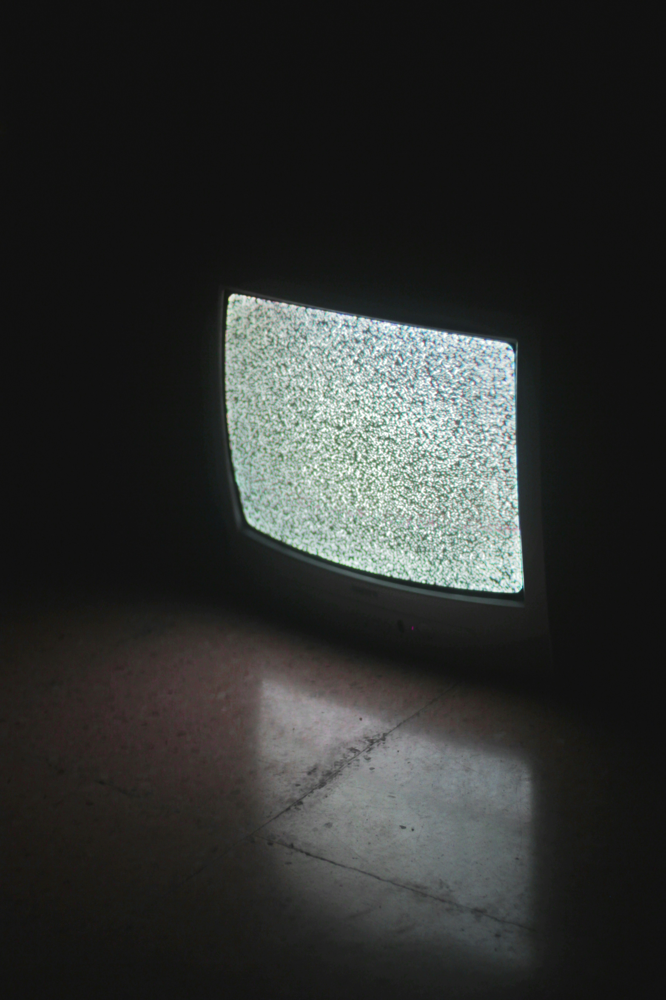

<!-- PROJECT SHIELDS -->
<!--
*** I'm using markdown "reference style" links for readability.
*** Reference links are enclosed in brackets [ ] instead of parentheses ( ).
*** See the bottom of this document for the declaration of the reference variables
*** for contributors-url, forks-url, etc. This is an optional, concise syntax you may use.
*** https://www.markdownguide.org/basic-syntax/#reference-style-links
-->
[![Contributors][contributors-shield]][contributors-url]
[![Forks][forks-shield]][forks-url]
[![Stargazers][stars-shield]][stars-url]
[![Issues][issues-shield]][issues-url]
[![LinkedIn][linkedin-shield]][linkedin-url]


<!-- PROJECT LOGO -->
<br />
<div align="center">
  <a href="https://github.com/othneildrew/Best-README-Template">
    
  </a>

  <h3 align="center">FuzzTheWorld</h3>

  <p align="center">
    A fuzzing suite for C/C++ programs, written in Rust.
    <br />
    </p>
</div>


<!-- TABLE OF CONTENTS -->
<details>
  <summary>Table of Contents</summary>
  <ol>
    <li>
      <a href="#about-the-project">About The Project</a>
      <ul>
        <li><a href="#built-with">Built With</a></li>
      </ul>
    </li>
    <li>
      <a href="#getting-started">Getting Started</a>
      <ul>
        <li><a href="#prerequisites">Prerequisites</a></li>
        <li><a href="#installation">Installation</a></li>
      </ul>
    </li>
    <li><a href="#usage">Usage</a></li>
    <li><a href="#roadmap">Roadmap</a></li>
    <li><a href="#contributing">Contributing</a></li>
    <li><a href="#contact">Contact</a></li>
    <li><a href="#acknowledgments">Acknowledgments</a></li>
  </ol>
</details>


<!-- ABOUT THE PROJECT -->
## About The Project

This fuzzing suite combines LLVM coverage instrumentation with random input generation to effectively test C/C++ programs. By leveraging Rust's safety guarantees and performance, it provides robust fuzzing capabilities with detailed coverage analysis. The suite automatically tracks execution paths, identifies crashes, and generates comprehensive reports, making it a valuable tool for finding potential vulnerabilities and bugs in C/C++ code.

### Features

* Random input generation with configurable parameters
* LLVM-based coverage tracking
* Coverage visualization with plotters
* LCOV report generation
* Crash detection and reproduction
* Support for ASan (Address Sanitizer)

<p align="right">(<a href="#readme-top">back to top</a>)</p>


### Built With

* [![Rust][Rust]][Rust-url]

<p align="right">(<a href="#readme-top">back to top</a>)</p>


<!-- GETTING STARTED -->
## Getting Started

The following instructions are for Arch Linux, if you are using a different
platform, please adjust accordingly.

### Prerequisites

Install Rust toolchain
* npm
  ```sh
  npm install npm@latest -g
  ```

### Installation

_Below is an example of how you can instruct your audience on installing and setting up your app. This template doesn't rely on any external dependencies or services._

1. Get a free API Key at [https://example.com](https://example.com)
2. Clone the repo
   ```sh
   git clone https://github.com/github_username/repo_name.git
   ```
3. Install NPM packages
   ```sh
   npm install
   ```
4. Enter your API in `config.js`
   ```js
   const API_KEY = 'ENTER YOUR API';
   ```
5. Change git remote url to avoid accidental pushes to base project
   ```sh
   git remote set-url origin github_username/repo_name
   git remote -v # confirm the changes
   ```

<p align="right">(<a href="#readme-top">back to top</a>)</p>


<!-- USAGE EXAMPLES -->
## Usage

Use this space to show useful examples of how a project can be used. Additional screenshots, code examples and demos work well in this space. You may also link to more resources.

_For more examples, please refer to the [Documentation](https://example.com)_

<p align="right">(<a href="#readme-top">back to top</a>)</p>


<!-- ROADMAP -->
## Roadmap

- [x] Add Changelog
- [x] Add back to top links
- [ ] Add Additional Templates w/ Examples
- [ ] Add "components" document to easily copy & paste sections of the readme
- [ ] Multi-language Support
    - [ ] Chinese
    - [ ] Spanish

See the [open issues](https://github.com/othneildrew/Best-README-Template/issues) for a full list of proposed features (and known issues).

<p align="right">(<a href="#readme-top">back to top</a>)</p>


<!-- CONTRIBUTING -->
## Contributing

Contributions are what make the open source community such an amazing place to learn, inspire, and create. Any contributions you make are **greatly appreciated**.

If you have a suggestion that would make this better, please fork the repo and create a pull request. You can also simply open an issue with the tag "enhancement".
Don't forget to give the project a star! Thanks again!

1. Fork the Project
2. Create your Feature Branch (`git checkout -b feature/AmazingFeature`)
3. Commit your Changes (`git commit -m 'Add some AmazingFeature'`)
4. Push to the Branch (`git push origin feature/AmazingFeature`)
5. Open a Pull Request

### Top contributors:

<a href="https://github.com/othneildrew/Best-README-Template/graphs/contributors">
  
</a>

<p align="right">(<a href="#readme-top">back to top</a>)</p>


<!-- LICENSE -->
## License

Distributed under the Unlicense License. See `LICENSE.txt` for more information.

<p align="right">(<a href="#readme-top">back to top</a>)</p>


<!-- CONTACT -->
## Contact

Your Name - [@nicholicaron](https://twitter.com/nicholicaron) - nicholicaron@gmail.com

Project Link: [https://github.com/nicholicaron/FuzzTheWorld](https://github.com/nicholicaron/FuzzTheWorld)

<p align="right">(<a href="#readme-top">back to top</a>)</p>


<!-- ACKNOWLEDGMENTS -->
## Acknowledgments

* [The Fuzzing Book](https://www.fuzzingbook.org/)
* [The Rust Book](https://doc.rust-lang.org/book/)

<p align="right">(<a href="#readme-top">back to top</a>)</p>


<!-- MARKDOWN LINKS & IMAGES -->
<!-- https://www.markdownguide.org/basic-syntax/#reference-style-links -->
[contributors-shield]: https://img.shields.io/github/contributors/nicholicaron/FuzzTheWorld.svg?style=for-the-badge
[contributors-url]: https://github.com/nicholicaron/FuzzTheWorld/graphs/contributors
[forks-shield]: https://img.shields.io/github/forks/nicholicaron/FuzzTheWorld.svg?style=for-the-badge
[forks-url]: https://github.com/nicholicaron/FuzzTheWorld/network/members
[stars-shield]: https://img.shields.io/github/stars/nicholicaron/FuzzTheWorld.svg?style=for-the-badge
[stars-url]: https://github.com/nicholicaron/FuzzTheWorld/stargazers
[issues-shield]: https://img.shields.io/github/issues/nicholicaron/FuzzTheWorld.svg?style=for-the-badge
[issues-url]: https://github.com/nicholicaron/FuzzTheWorld/issues
[license-shield]: 
[license-url]:
[linkedin-shield]: https://img.shields.io/badge/-LinkedIn-black.svg?style=for-the-badge&logo=linkedin&colorB=555
[linkedin-url]: https://linkedin.com/in/nicholicaron
[product-screenshot]: images/screenshot.png
[Rust]: https://shields.io/badge/-Rust-3776AB?style=flat&logo=rust
[Rust-url]: https://www.rust-lang.org/
